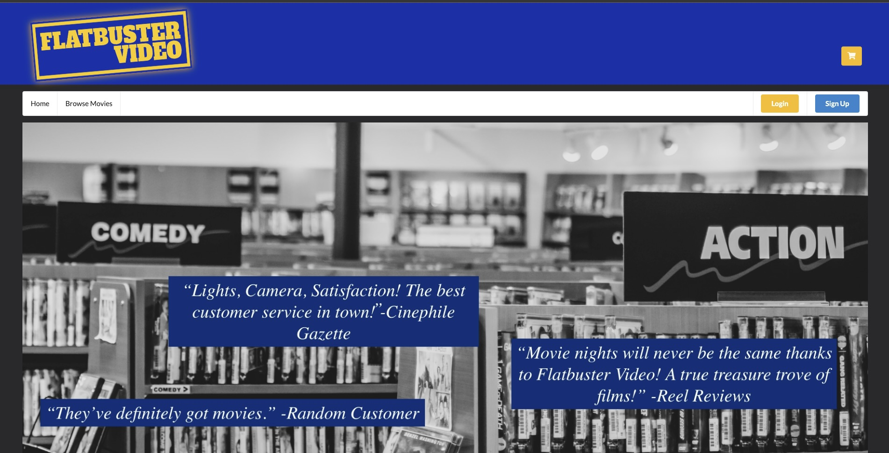

# Flatbuster Video - Movie Rental App

Flatbuster Video is a movie rental application that allows users to create accounts, add movies to their cart, make rentals, and manage their account information. The app is built using Python and Flask for the backend and ReactJs for the frontend.

==================================================

=================================================

## Getting Started

These instructions will help you set up and run the Flatbuster Video app on your local machine.

### Contributors
Alberto Sierra
Brian Richie
Wesley Smith

### Installing

#### Backend (Flask)

1. Clone the repository:
    git clone https://github.com/your-username/flatbuster-video-backend.git

2. Navigate to the backend folder:
    cd server

3. Create a virtual environment:
    python -m venv venv

4. Install dependencies:
    pipenv install
    pipenv shell

5. Set up the database:
    flask db init
    flask db migrate
    flask db upgrade
    python seed.py

6. Run the Flask application:
    python app.py

The backend server should now be running at http://localhost:5555.

#### Frontend (ReactJs)

1. Open a new terminal window.

2. Navigate to the frontend folder:
    cd client

3. Install dependencies:
    npm install

4. Run the React application:
    npm start

The frontend development server should now be running at http://localhost:3000.

#### Usage
1. Open your web browser and go to http://localhost:3000.

2. Sign up for a new account or log in if you already have one.

3. Browse movies, add them to your cart, and proceed to checkout to make a rental.

4. Manage your account by editing your information or deleting your account.

Contributing
If you'd like to contribute to Flatbuster Video, please fork the repository and create a pull request. You can also open an issue for bug reports or feature requests.

License
This project is licensed under the MIT License.